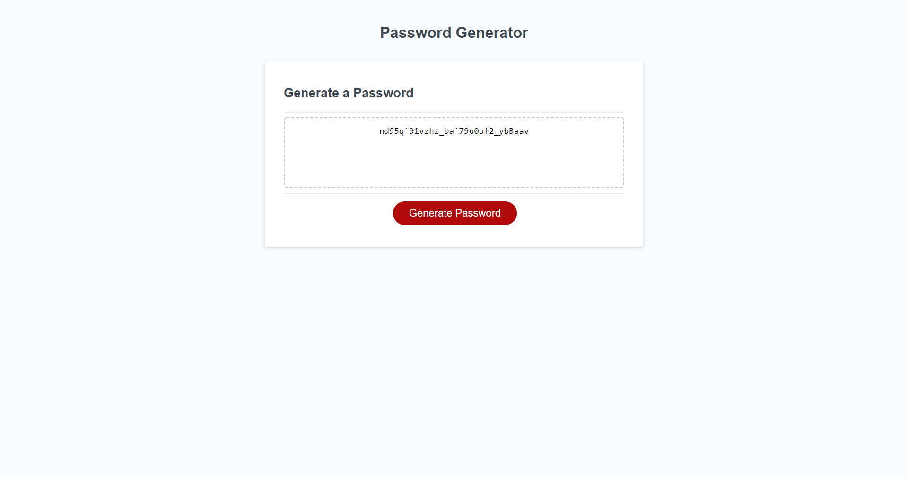

# passwordGenerator
This code is for a password generator. It includes prompts to determine how many characters the user wants their password to be and if they would like to include lower case, upper case, numbers, or special characters. It outputs a randomized password to the users specification. 

The code works by creating an array for each of the options above, adding a random amount from each based on the users selected characters to a new array, and then using a while loop to fill any missing characters. 

A shuffling fuction found on stackoverflow was added at the end to randomize the created array.

Screenshot of finished work can be seen below:

The website is deployed [here](https://bhodge166.github.io/passwordGenerator/)
